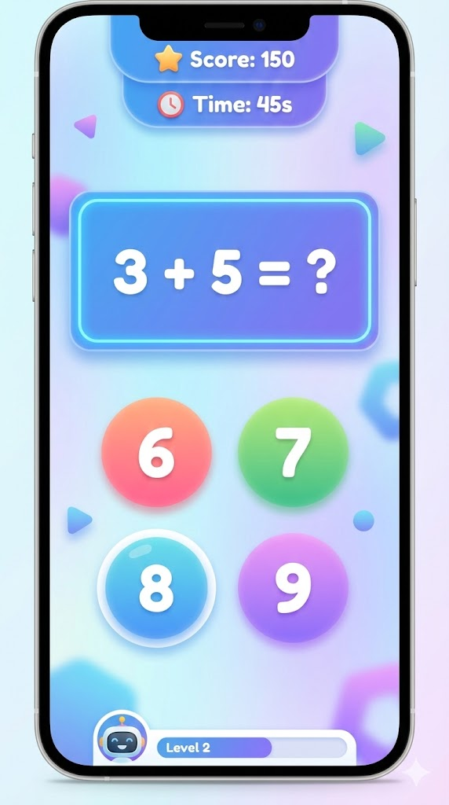

# Aritme(bu)tikk

Et morsomt og fargerikt aritmetikk-spill for barn, bygget med Flutter. Svar riktig pa regneoppgaver, tjen poeng og bruk dem i butikken!

<p align="center">
  
</p>

## Funksjoner

- **Fire regnearter** -- addisjon, subtraksjon, ganging og deling
- **Tre vanskelighetsgrader** -- lett, middels og vanskelig for hver kategori
- **10 nivaer** -- progressiv vanskelighetsgrad med tidsbegrensning
- **Poengsystem** -- tjen poeng for riktige svar, med multiplikator for hoeyere vanskelighetsgrad
- **Butikk** -- bruk opptjente poeng pa skjermtid eller lommepenger
- **Highscores** -- folg fremgangen din over tid
- **Lydeffekter** -- lyd for riktig svar, feil svar, nivaoppgang og mer
- **Animasjoner** -- konfetti, shake-effekter og animert bakgrunn

## Kom i gang

### Forutsetninger

- [Flutter SDK](https://flutter.dev/docs/get-started/install) (3.10.8+)
- En editor som VS Code eller Android Studio

### Installasjon

```bash
git clone https://github.com/krestian83/aritmebutikk.git
cd aritmebutikk
flutter pub get
flutter run
```

## Prosjektstruktur

```
lib/
  app/              # App-konfigurasjon og tema
    theme/          # Farger og tema-definisjon
  game/             # Spillogikk
    config/         # Nivakonfigurasjon
    models/         # Datamodeller (sporsmal, kategorier, butikkvarer)
    services/       # Lyd, highscore og poeng-tjenester
    systems/        # Nivahandtering, sporsmalsgenerering, poengberegning, timer
  ui/               # Brukergrensesnitt
    screens/        # Skjermer (meny, kategori, spill, butikk, highscores)
    widgets/        # Gjenbrukbare widgets (svar-knapper, HUD, effekter)
```

## Plattformer

- Android
- iOS
- Web
- Windows

## Teknologi

- [Flutter](https://flutter.dev/) -- UI-rammeverk
- [audioplayers](https://pub.dev/packages/audioplayers) -- lydavspilling
- [shared_preferences](https://pub.dev/packages/shared_preferences) -- lokal lagring av poeng og highscores
